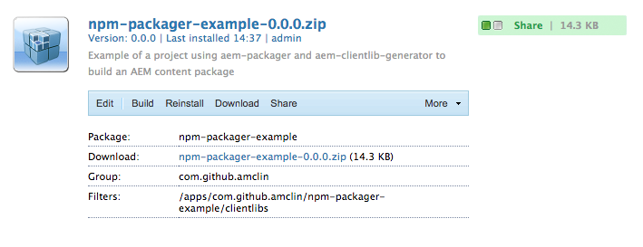

# aem-packager-example

This is a simple example NodeJS project using [aem-packager](https://www.npmjs.com/package/aem-packager) and [aem-clientlib-generator](https://www.npmjs.com/package/aem-clientlib-generator) to build deployable content packages that can be installed into Adobe Experience Manager via the AEM Package Manager.

## External Dependencies
If you don't already have Maven installed on your system, you will need to get it.

## Building and Installing
### 1. Checkout this repo
`git clone https://github.com/amclin/aem-packager-example`

### 2. Install NPM dependencies
`npm install`

### 3. Run a build that outputs AEM Clientlibs and creates an installable package
`npm run build`

### 5. Install the AEM Content Package
  1. Navigate to your AEM Package Manager (Local dev instances usually run at http://localhost:4502/crx/packmgr/index.jsp)
  2. Choose `Upload Package` and browse for the .zip file created in the `target` folder
  3. After uploading, review your package and click the `Install` button

## More Information
For more details on how to setup a NodeJS project so it can be compiled and installed into AEM, see [aem-packager](https://github.com/amclin/aem-packager)

<!-- sample change -->